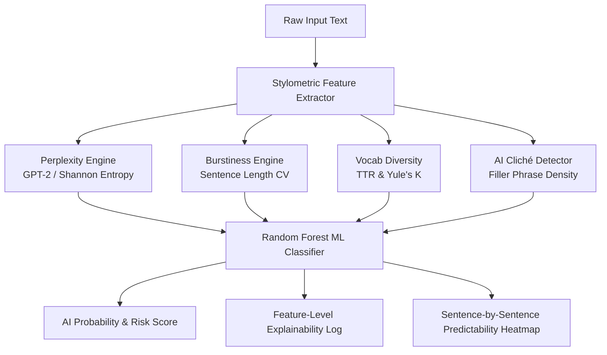

# 🛡️ NotByHuman — Transparent AI Text & Stylometric Detector

[](https://www.python.org/)
[](https://fastapi.tiangolo.com/)
[](https://react.dev/)
[](https://vitejs.dev/)
[](LICENSE)

> An open-source, explainable AI text detection tool using stylometric features (perplexity, burstiness, vocabulary diversity, and structural patterns) paired with a calibrated ML classifier and interactive explainability dashboard.

---

## 📌 Problem & Motivation

Most commercial AI detectors (such as GPTZero or Turnitin) operate as black boxes, providing arbitrary confidence percentages without showing *why* a piece of text was flagged. This lack of transparency leads to confusion, false positives, and mistrust among students, writers, and educators.

**NotByHuman** bridges this gap by engineering explicit **stylometric linguistic features**—the quantifiable fingerprints that separate human writing from AI language models.

---

## 🧠 The Core Science: How AI Text differs from Human Text

Even when large language models (LLMs) produce fluent text, they leave statistical signatures:



### Key Stylometric Fingerprints

1. **Perplexity (Predictability)**:
   - Measures how "surprised" a language model is by the word sequence.
   - **AI Text**: Low perplexity. LLMs generate text by repeatedly choosing high-probability next tokens.
   - **Human Text**: High perplexity. Humans use creative, non-standard, and unpredictable word pairings.

2. **Burstiness (Rhythm Variation)**:
   - Sentence length coefficient of variation ($CV = \frac{\sigma}{\mu}$).
   - **AI Text**: Uniform rhythm. LLMs generate sentences with consistent length and structure.
   - **Human Text**: High burstiness. Humans alternate between short, punchy sentences and longer, complex thoughts.

3. **Vocabulary Diversity (Type-Token Ratio & Yule's K)**:
   - Ratio of unique words (types) to total words (tokens).
   - **AI Text**: Lower unique word ratios due to core vocabulary repetition.
   - **Human Text**: Richer vocabulary variety with lower word repetition.

4. **AI Cliché Phrase Density**:
   - Detects overused LLM transition words and filler phrases (*"furthermore"*, *"delve"*, *"tapestry"*, *"crucial"*, *"in conclusion"*, *"it is important to note"*, *"pivotal role"*).

---

## 🛠️ Tech Stack & Architecture

- **Backend**: Python 3.10+, FastAPI, Uvicorn, scikit-learn, PyTorch, HuggingFace Transformers (GPT-2), NLTK, Pandas, NumPy, python-docx, joblib.
- **Frontend**: React 18, Vite, Lucide-React Icons, Vanilla CSS (Glassmorphism dark mode design system).

---

## 📂 Project Structure

```
NotByHuman/
├── backend/
│   ├── app/
│   │   ├── __init__.py
│   │   ├── main.py              # FastAPI REST Endpoints (/api/analyze, /api/upload)
│   │   ├── stylometrics.py      # Stylometric Feature Engine
│   │   ├── model.py             # Random Forest Classifier & Explainability Manager
│   │   └── utils.py             # Text Cleaners & Document Parsers (.txt, .docx)
│   ├── models/
│   │   └── notbyhuman_classifier.joblib # Calibrated Classifier
│   ├── train.py                 # Model Calibration & Trainer Script
│   ├── run.py                   # Server Starter Script
│   └── requirements.txt         # Python Dependencies
├── frontend/
│   ├── src/
│   │   ├── components/
│   │   │   ├── Header.jsx       # Branding & Header
│   │   │   ├── InputSection.jsx # Text Input, File Drag-Drop, Sample Loader
│   │   │   ├── ResultsGauge.jsx # Animated Circular Gauge & Risk Badge
│   │   │   ├── FeatureCards.jsx # Detailed Stylometric Cards & Explainability Log
│   │   │   ├── SentenceHeatmap.jsx # Interactive Sentence Predictability Highlighter
│   │   │   └── Disclaimer.jsx   # Honest Limitations & Portfolio Rationale
│   │   ├── App.jsx              # Main Dashboard Component
│   │   ├── index.css            # Dark Mode Design System
│   │   └── main.jsx
│   ├── dist/                    # Compiled Production Assets
│   ├── package.json
│   └── vite.config.js
└── README.md                    # Detailed Project Documentation
```

---

## 🚀 Local Installation & Setup

### Prerequisites
- Node.js (v18+)
- Python (v3.10+)

### 1. Start FastAPI Backend

```bash
cd backend

# Create virtual environment
python3 -m venv venv
source venv/bin/activate  # On Windows: venv\Scripts\activate

# Install dependencies
pip install -r requirements.txt

# Launch API server
python run.py
```
> Server runs on **`http://localhost:8000`** (Interactive OpenAPI docs at `http://localhost:8000/docs`).

### 2. Start React Frontend

```bash
cd frontend

# Install Node modules
npm install

# Start Vite dev server
npm run dev
```
> Frontend application opens at **`http://localhost:5173`**.

---

## 🔌 API Reference

### `POST /api/analyze`
Analyzes raw text for stylometric AI indicators.

**Request Body**:
```json
{
  "text": "Furthermore, urban architecture serves as a testament to the ever-evolving interplay..."
}
```

**Response**:
```json
{
  "word_count": 54,
  "ai_probability": 0.85,
  "ai_percentage": 85,
  "classification": "AI-Generated",
  "risk_level": "High Risk",
  "verdict_summary": "High probability of AI generation based on uniform sentence structures...",
  "metrics": {
    "perplexity": 26.5,
    "burstiness_cv": 0.18,
    "ttr": 0.52,
    "ai_phrase_density": 1.85
  },
  "explanations": [...],
  "sentence_highlights": [...],
  "flagged_phrases": [...]
}
```

### `POST /api/upload`
Uploads `.txt` or `.docx` document files for parsing and analysis.

### `GET /api/samples`
Returns pre-loaded Human vs. AI essay samples for instant testing.

---

## 🔬 Feature Matrix

| Feature Metric | Formula / Calculation | Human Signature | AI Signature |
| :--- | :--- | :--- | :--- |
| **Burstiness (CV)** | $CV = \frac{\sigma}{\mu}$ of sentence lengths | $CV > 0.50$ (Dynamic flow) | $CV < 0.25$ (Uniform rhythm) |
| **Perplexity (PPL)** | $\exp(\text{Cross-Entropy})$ | $\text{PPL} > 70$ (Surprising choices) | $\text{PPL} < 35$ (Predictable choices) |
| **Type-Token Ratio (TTR)** | $\frac{\text{Unique Words}}{\text{Total Words}}$ | $\text{TTR} > 0.65$ (Rich vocabulary) | $\text{TTR} < 0.50$ (Repeated core words) |
| **AI Cliché Density** | $\frac{\text{Flagged Phrases}}{\text{Total Words}} \times 100$ | $0.0\%$ density | $> 1.5\%$ density |

---

## ⚠️ Honest Limitations & False Positive Analysis

NLP stylometrics are **probabilistic estimation tools**, not infallible truth meters:
1. **Academic Writing**: Formal academic papers or non-native English writing may exhibit lower burstiness, occasionally raising false positive alerts.
2. **Polished AI Writing**: AI text manually edited to add sentence length variation can lower predictability and reduce detection confidence.
3. **Sample Length**: Inputs should be at least **30–50 words** for statistical reliability.

---

## 📜 License

MIT License. Built for portfolio demonstration and NLP research.
