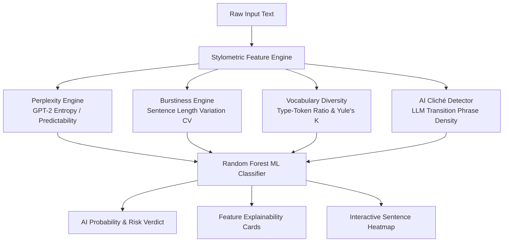

# 🛡️ NotByHuman — Transparent AI Text & Stylometric Detector

<div align="center">

  

  ### **DETECT. VERIFY. EXPOSE.**

  [](https://not-by-human.vercel.app)
  [](LICENSE)
  [](https://www.python.org/)
  [](https://fastapi.tiangolo.com/)
  [](https://react.dev/)

</div>

---

## 🌟 Live Demo

👉 **Try it Live in Production**: **[https://not-by-human.vercel.app](https://not-by-human.vercel.app)**

An open-source, explainable AI text detection dashboard and API using **stylometric linguistic fingerprints** (perplexity, burstiness, vocabulary diversity, and structural patterns) paired with a calibrated Machine Learning classifier.

---

## ✨ Key Features

- 🧠 **Explainable AI Detector**: No mystery black-box scores. Explains *why* text is flagged using concrete statistical metrics.
- 💊 **Capsule Pill Search Bar**: Paste text, upload documents (`.txt`, `.docx`), or photo screenshots (`.png`, `.jpg`) for instant OCR extraction.
- 🔀 **Rotating Sample Pools**: Instant quick-demo buttons for diverse Human and AI (GPT-4) essay samples that rotate on every click.
- 🎨 **Glassmorphism UI**: High-contrast dark obsidian interface, universal glassmorphic buttons, and 120fps hardware-accelerated scrolling.
- 🔍 **Native Orange Cursor**: Custom theme-orange magnifying glass mouse pointer for an immersive detective experience.
- ⚡ **Chrome Extension Included**: Highlight any text on any website to inspect it immediately (`/extension`).

---

## 🧠 The Science: How AI Text Differs From Human Writing

Even when large language models (LLMs like GPT-4 or Claude) produce fluent text, they leave quantifiable statistical signatures:



### Stylometric Metrics Matrix

| Metric | How It Works | Human Signature | AI Signature (GPT-4 / Claude) |
| :--- | :--- | :--- | :--- |
| **Burstiness (CV)** | Sentence length variance ($CV = \frac{\sigma}{\mu}$) | $CV > 0.50$ (Dynamic rhythm) | $CV < 0.25$ (Uniform sentence lengths) |
| **Perplexity (PPL)** | Word choice predictability via GPT-2 | $\text{PPL} > 70$ (Creative choices) | $\text{PPL} < 35$ (Predictable next-tokens) |
| **Type-Token Ratio (TTR)** | $\frac{\text{Unique Words}}{\text{Total Words}}$ | $\text{TTR} > 0.65$ (Rich vocabulary) | $\text{TTR} < 0.50$ (Repeated core vocabulary) |
| **AI Cliché Density** | Density of filler transitions (*"furthermore"*, *"pivotal role"*, *"tapestry"*) | $0.0\%$ density | $> 1.5\%$ density |

---

## 🏗️ Project Architecture

```
NotByHuman/
├── backend/
│   ├── app/
│   │   ├── main.py              # FastAPI REST Endpoints (/api/analyze, /api/upload, /api/samples)
│   │   ├── stylometrics.py      # Perplexity, Burstiness & Stylometric Extractor
│   │   ├── model.py             # Random Forest Classifier & Explainability Engine
│   │   └── utils.py             # Document Parsers (.txt, .docx, OCR Images)
│   ├── models/
│   │   └── notbyhuman_classifier.joblib # Calibrated ML Model
│   ├── run.py                   # FastAPI Server Entry Point
│   └── requirements.txt         # Python Dependencies
├── frontend/
│   ├── src/
│   │   ├── components/          # React Dashboard Components
│   │   ├── App.jsx              # Hardware Accelerated 2-Page Scroll App
│   │   ├── index.css            # Glassmorphic Dark Mode Design System
│   │   └── main.jsx
│   ├── dist/                    # Production Output
│   └── package.json
├── extension/                   # Manifest V3 Chrome Extension
├── vercel.json                  # Vercel Production Build Config
└── render.yaml                  # Render Backend API Config
```

---

## 🚀 Quick Start / Local Installation

### Prerequisites
- Node.js (v18+)
- Python (v3.10+)

### 1. Start FastAPI Backend API

```bash
cd backend

# Create & activate virtual environment
python3 -m venv venv
source venv/bin/activate  # On Windows: venv\Scripts\activate

# Install dependencies
pip install -r requirements.txt

# Launch API server
python run.py
```
> API runs locally at **`http://localhost:8000`** (Interactive OpenAPI docs at `http://localhost:8000/docs`).

### 2. Start React Frontend Dashboard

```bash
cd frontend

# Install Node modules
npm install

# Start Vite dev server
npm run dev
```
> Dashboard runs locally at **`http://localhost:5173`**.

---

## 🌐 Deploy to Vercel & Render

The repository is **100% pre-configured** for instant deployment:

- **Frontend (Vercel)**: Import `ANKARAHAMSA/NotByHuman` at [vercel.com/new](https://vercel.com/new). Vercel will build using `vercel.json` in ~30 seconds!
- **Backend (Render)**: Connect `ANKARAHAMSA/NotByHuman` at [dashboard.render.com](https://dashboard.render.com). Render auto-deploys using `render.yaml`!

---

## 🔌 API Reference

### `POST /api/analyze`
Analyzes raw text for stylometric AI indicators.

**Request**:
```json
{
  "text": "Furthermore, urban architecture serves as a testament to the ever-evolving interplay..."
}
```

**Response**:
```json
{
  "word_count": 54,
  "ai_probability": 0.88,
  "ai_percentage": 88,
  "classification": "AI-Generated",
  "risk_level": "High Risk",
  "verdict_summary": "High probability of AI authorship due to low perplexity and uniform sentence structure.",
  "metrics": {
    "perplexity": 24.5,
    "burstiness_cv": 0.18,
    "ttr": 0.52,
    "ai_phrase_density": 1.85
  },
  "sentence_highlights": [...],
  "flagged_phrases": [...]
}
```

---

## ⚠️ Honest Limitations

Stylometric analysis is **probabilistic estimation**, not infallible truth:
1. **Formal Academic Papers**: Highly structured human writing may yield lower burstiness.
2. **Polished AI Writing**: AI text manually edited to add rhythm variations will lower predictability scores.
3. **Sample Length**: Inputs should contain at least **30–50 words** for statistical confidence.

---

## 📜 License

MIT License. Built for NLP research, open-source transparency, and portfolio demonstration.
